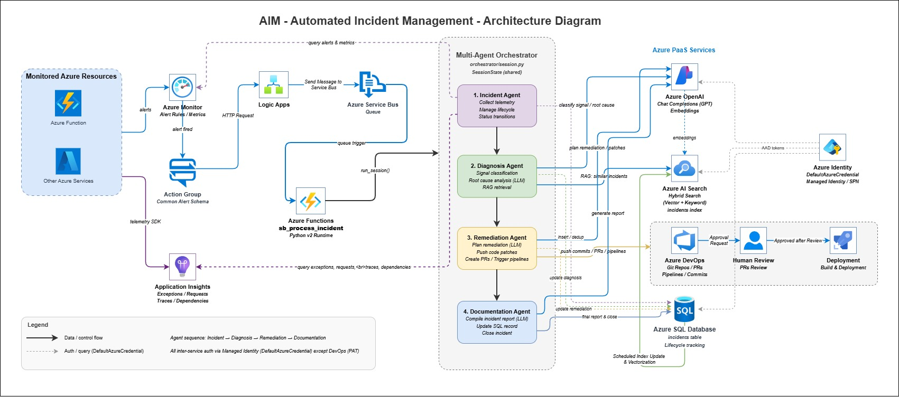

# AIM - Automated Incident Management

An AIOps system built on **Azure Functions** that autonomously detects, diagnoses, remediates, and documents infrastructure incidents. When an Azure Monitor alert fires, the system orchestrates a sequential pipeline of four AI agents — each powered by Azure OpenAI — and produces a pull request with a code or configuration fix, a full incident report in Azure SQL, and a rich knowledge base entry for future retrieval.

---

## Architecture



```
Azure Monitor Alert
        │ (Common Alert Schema)
        ▼
Azure Service Bus Queue
        │
        ▼
┌─────────────────────────────────────────────────────────┐
│              Azure Function  (function_app.py)          │
│                                                         │
│   ┌─────────────────────────────────────────────────┐   │
│   │          Sequential Agent Pipeline              │   │
│   │                                                 │   │
│   │  1. Incident Agent                              │   │
│   │     ├─ Collects Azure Monitor alerts & metrics  │   │
│   │     ├─ Queries App Insights (exceptions,        │   │
│   │     │  failed requests, traces, dependencies)   │   │
│   │     └─ Manages incident lifecycle in SQL        │   │
│   │                                                 │   │
│   │  2. Diagnosis Agent                             │   │
│   │     ├─ Classifies: incident / normal_log /      │   │
│   │     │  invalid_api_call                         │   │
│   │     ├─ Determines severity (P1–P4) & root cause │   │
│   │     └─ RAG retrieval of similar past incidents  │   │
│   │                                                 │   │
│   │  3. Remediation Agent                           │   │
│   │     ├─ Proposes surgical code/config patches    │   │
│   │     ├─ Fetches live file content from repo      │   │
│   │     ├─ Detects language & coding conventions    │   │
│   │     ├─ Commits fix to a new branch in DevOps    │   │
│   │     └─ Opens PR → awaits human review           │   │
│   │                                                 │   │
│   │  4. Documentation Agent                         │   │
│   │     ├─ Compiles structured incident report      │   │
│   │     └─ Persists report to Azure SQL             │   │
│   └─────────────────────────────────────────────────┘   │
└─────────────────────────────────────────────────────────┘
        │                   │                   │
        ▼                   ▼                   ▼
  Azure SQL DB        Azure DevOps         Azure AI Search
  (incident log)      (branch + PR)        (knowledge base)
```

---

## Key Features

- **No hardcoded thresholds or playbooks** — all reasoning is performed by the LLM, grounded on real telemetry evidence.
- **Hybrid RAG retrieval** — combines keyword and vector search against past incidents to inform diagnosis and remediation.
- **Surgical code patching** — the remediation agent reads the live file from the repo, detects the programming language and coding conventions, and produces character-perfect hunks (not full file rewrites).
- **Language-aware comments & indentation** — generated patches follow the indentation style and naming conventions observed in the real file, with meaningful comments explaining *why* each change was made.
- **PR-based workflow** — fixes are committed to a dedicated `aiops/remediation/{incident_id}` branch and a pull request is opened for developer review. No automatic merge occurs.
- **Built-in deduplication** — idempotency check prevents duplicate sessions for the same incident within a configurable time window.
- **Transient SQL retry** — exponential back-off retry for Azure SQL cold-start and transient connectivity errors.
- **Managed Identity auth** — all Azure service calls use `DefaultAzureCredential`; no secrets embedded in code.

---

## Agent Pipeline

| Agent | Responsibility | Output |
|---|---|---|
| **Incident Agent** | Gathers full telemetry (alerts, metrics, exceptions, traces, dependencies) | `state.telemetry` |
| **Diagnosis Agent** | Classifies the signal and identifies root cause via LLM + RAG | `state.diagnosis`, `state.knowledge_snippets` |
| **Remediation Agent** | Plans and executes the fix; opens a DevOps PR | `state.remediation`, DevOps PR |
| **Documentation Agent** | Writes the incident report to SQL and closes the session | `state.documentation`, SQL record |

---

## Prerequisites

| Requirement | Notes |
|---|---|
| Python 3.11 | Match the Azure Function runtime version |
| Azure Functions Core Tools v4 | `func --version` |
| Azure CLI | `az --version` |
| ODBC Driver 18 for SQL Server | Required by `pyodbc` — [download here](https://learn.microsoft.com/sql/connect/odbc/download-odbc-driver-for-sql-server) |
| Azure Function App | Python runtime, Service Bus trigger |
| Azure Service Bus | Namespace + queue (Standard tier or above) |
| Azure OpenAI | Chat (GPT-4o) + Embedding (text-embedding-3-large or ada-002) deployments |
| Azure AI Search | Standard tier recommended; index created per the schema below |
| Azure SQL Database | Schema applied from `schema.sql` |
| Azure DevOps | Organisation, project, repo, PAT with Code (Read & Write), Pull Request (Contribute), and Build (Read & Execute) permissions |
| Application Insights | App ID (found on the Overview blade) for KQL telemetry queries |

---

## Getting Started

### 1. Clone the repository

```bash
git clone <repo-url>
cd AIM
```

### 2. Create and activate the virtual environment

```bash
python -m venv .venv
# Windows
.venv\Scripts\activate
# Linux / macOS
source .venv/bin/activate
```

### 3. Install dependencies

```bash
pip install -r requirements.txt
```

### 4. Provision the Azure SQL schema

Run `schema.sql` against your Azure SQL Database:

```bash
sqlcmd -S <server>.database.windows.net -d <database> -G -i schema.sql
```

### 5. Configure environment variables

Copy the template and fill in your values:

```bash
cp .env.example .env
```

Edit `.env` with your resource endpoints, deployment names, and credentials. The file is gitignored and must never be committed.

For the Azure Functions runtime, also create `local.settings.json` (excluded from source control):

```json
{
  "IsEncrypted": false,
  "Values": {
    "AzureWebJobsStorage": "UseDevelopmentStorage=true",
    "AzureWebJobsServiceBus": "<service-bus-connection-string>",
    "ServiceBusQueueName": "<queue-name>",
    "AZURE_OPENAI_ENDPOINT": "https://<resource>.openai.azure.com/",
    "AZURE_OPENAI_CHAT_DEPLOYMENT": "<gpt-4o-deployment-name>",
    "AZURE_OPENAI_EMBEDDING_DEPLOYMENT": "<embedding-deployment-name>",
    "AZURE_OPENAI_API_VERSION": "2025-01-01-preview",
    "AZURE_SEARCH_ENDPOINT": "https://<resource>.search.windows.net",
    "AZURE_SEARCH_INDEX_NAME": "incidents",
    "AZURE_SUBSCRIPTION_ID": "<subscription-id>",
    "MONITORED_RESOURCE_ID": "<default-resource-id>",
    "APPINSIGHTS_APP_ID": "<application-insights-app-id>",
    "AZDO_ORG": "<devops-organisation>",
    "AZDO_PROJECT": "<devops-project>",
    "AZDO_REPO": "<repository-name>",
    "AZDO_PAT": "<personal-access-token>",
    "AZDO_BRANCH": "main",
    "SQL_CONNECTION_STRING": "Driver={ODBC Driver 18 for SQL Server};Server=tcp:<server>.database.windows.net,1433;Database=<db>;Authentication=ActiveDirectoryMsi;",
    "MAX_AGENT_ITERATIONS": "10",
    "SESSION_TIMEOUT_SECONDS": "300",
    "DEDUP_WINDOW_MINUTES": "60"
  }
}
```

### 6. Authenticate locally

The function uses `DefaultAzureCredential`. Run `az login` before starting:

```bash
az login
az account set --subscription <subscription-id>
```

### 7. Run locally

```bash
func start
```

To test end-to-end, send a sample message to your Service Bus queue using the Azure portal or:

```bash
# Using Azure CLI Service Bus extension
az servicebus queue message send \
  --resource-group <rg> \
  --namespace-name <namespace> \
  --queue-name <queue> \
  --body '{"schemaId":"azureMonitorCommonAlertSchema","data":{"essentials":{"alertId":"/subscriptions/sub/alerts/test","alertRule":"Test Alert","severity":"Sev2","signalType":"Metric","monitorCondition":"Fired","alertTargetIDs":["/subscriptions/sub/resourceGroups/rg/providers/Microsoft.Compute/virtualMachines/vm"],"firedDateTime":"2026-03-15T10:00:00Z"},"alertContext":{}}}'
```

### 8. Deploy to Azure

```bash
func azure functionapp publish <function-app-name> --python
```

---

## Azure Resource Setup

### Managed Identity — RBAC Role Assignments

After enabling a System-assigned Managed Identity on the Function App, grant it the following roles:

| Resource | Role |
|---|---|
| Azure OpenAI | Cognitive Services OpenAI User |
| Azure AI Search | Search Index Data Reader + Search Index Data Contributor |
| Azure SQL Database | `db_datareader` + `db_datawriter` (via `CREATE USER [<function-app-name>] FROM EXTERNAL PROVIDER`) |
| Azure Service Bus namespace | Azure Service Bus Data Receiver |
| Azure Subscription (or resource group) | Monitoring Reader |
| Application Insights | Monitoring Reader |

> **Note:** The Azure DevOps PAT cannot use Managed Identity — store it in Azure Key Vault and reference it via `@Microsoft.KeyVault(SecretUri=...)` in App Settings.

---

### Azure AI Search Index Schema

Create an index named `incidents` (or your configured `AZURE_SEARCH_INDEX_NAME`) with the following fields:

| Field | Type | Attributes |
|---|---|---|
| `id` | `Edm.String` | Key, Retrievable |
| `incident_id` | `Edm.String` | Retrievable, Filterable |
| `summary` | `Edm.String` | Retrievable, Searchable |
| `root_cause` | `Edm.String` | Retrievable, Searchable |
| `remediation` | `Edm.String` | Retrievable, Searchable |
| `severity` | `Edm.String` | Retrievable, Filterable |
| `incident_type` | `Edm.String` | Retrievable, Filterable |
| `created_at` | `Edm.DateTimeOffset` | Retrievable, Filterable, Sortable |
| `summary_vector` | `Collection(Edm.Single)` | Retrievable; dimensions must match your embedding model (e.g. `3072` for `text-embedding-3-large`, `1536` for `ada-002`) |

Enable the **vector search** configuration on `summary_vector` using the HNSW algorithm. The hybrid search in `services/azure_search.py` issues both a keyword query and a vector query against this index.

---

### Azure Monitor → Service Bus Integration

The function is triggered by Azure Monitor alerts delivered via Service Bus. To wire this up:

1. **Create an Action Group** in Azure Monitor:
   - Go to **Monitor → Alerts → Action groups → + Create**
   - Add an action of type **Azure Service Bus Queue**
   - Select your Service Bus namespace and queue
   - Enable **Common Alert Schema**

2. **Attach the Action Group to an Alert Rule**:
   - Go to **Monitor → Alert rules → + Create**
   - Define the signal (metric, log, activity log)
   - Under **Actions**, select the Action Group created above

3. When the alert fires, Azure Monitor sends a Common Alert Schema JSON payload to the Service Bus queue, which triggers the function automatically.

---

## Project Structure

```
AIM/
├── function_app.py           # Service Bus trigger & pipeline entry point
├── host.json                 # Azure Functions host configuration
├── requirements.txt          # Python dependencies
├── schema.sql                # Azure SQL schema for the incidents table
├── agents/
│   ├── incident_agent.py     # Telemetry collection & lifecycle management
│   ├── diagnosis_agent.py    # Signal classification & root-cause analysis
│   ├── remediation_agent.py  # Code patching, DevOps branch & PR creation
│   └── documentation_agent.py# Incident report generation & SQL persistence
├── orchestrator/
│   └── session.py            # SessionState, agent protocol & run loop
└── services/
    ├── azure_openai.py       # Chat completion & embedding wrappers
    ├── azure_search.py       # Hybrid RAG search client
    ├── config.py             # Settings loaded from environment variables
    ├── devops_client.py      # Azure DevOps REST API (push, PR, pipeline)
    ├── sql_client.py         # Azure SQL CRUD with transient retry
    └── telemetry.py          # Azure Monitor alerts, metrics & App Insights
```

---

## Incident Lifecycle

```
open → investigating → mitigating → sent_for_human_review
                                  → resolved → closed
                                  → needs_human_review   (timeout / escalation)
```

| Status | Trigger |
|---|---|
| `open` | Incident record created |
| `investigating` | Diagnosis agent running |
| `mitigating` | Operational remediation applied |
| `sent_for_human_review` | Code fix committed; PR opened for developer review |
| `resolved` / `closed` | Documentation agent confirms resolution |
| `needs_human_review` | Session timeout or LLM escalation |

---

## Service Bus Message Format

The function expects the **Azure Monitor Common Alert Schema**:

```json
{
  "schemaId": "azureMonitorCommonAlertSchema",
  "data": {
    "essentials": {
      "alertId": "/subscriptions/.../alerts/...",
      "alertRule": "High CPU Alert",
      "severity": "Sev2",
      "signalType": "Metric",
      "monitorCondition": "Fired",
      "alertTargetIDs": ["/subscriptions/.../resourceGroups/.../providers/..."],
      "firedDateTime": "2026-03-14T10:00:00Z"
    },
    "alertContext": {}
  }
}
```

A plain JSON object or Event Grid array is also accepted as a fallback.

---

## Environment Variables Reference

| Variable | Required | Description |
|---|---|---|
| `AzureWebJobsServiceBus` | ✅ | Service Bus connection string |
| `ServiceBusQueueName` | ✅ | Queue name |
| `AZURE_OPENAI_ENDPOINT` | ✅ | Azure OpenAI resource endpoint |
| `AZURE_OPENAI_CHAT_DEPLOYMENT` | ✅ | Chat model deployment name |
| `AZURE_OPENAI_EMBEDDING_DEPLOYMENT` | ✅ | Embedding model deployment name |
| `AZURE_OPENAI_API_VERSION` | | API version (default: `2025-01-01-preview`) |
| `AZURE_SEARCH_ENDPOINT` | ✅ | Azure AI Search endpoint |
| `AZURE_SEARCH_INDEX_NAME` | | Index name (default: `incidents`) |
| `AZURE_SUBSCRIPTION_ID` | | Subscription ID for Monitor API calls |
| `APPINSIGHTS_APP_ID` | | Application Insights App ID for KQL queries |
| `MONITORED_RESOURCE_ID` | | Fallback resource ID if not in alert payload |
| `AZDO_ORG` | | Azure DevOps organisation name |
| `AZDO_PROJECT` | | Azure DevOps project name |
| `AZDO_REPO` | | Repository name |
| `AZDO_PAT` | | Personal Access Token (Code Read & Write, Pull Request Contribute, Build Read & Execute) |
| `AZDO_BRANCH` | | Target branch for PRs (default: `main`) |
| `SQL_CONNECTION_STRING` | ✅ | pyodbc connection string |
| `MAX_AGENT_ITERATIONS` | | Max agents per session (default: `10`) |
| `SESSION_TIMEOUT_SECONDS` | | Session wall-clock timeout (default: `300`) |
| `DEDUP_WINDOW_MINUTES` | | Dedup window in minutes (default: `60`) |

---

## Security

- All Azure service authentication uses **Managed Identity** (`DefaultAzureCredential`) — no API keys stored in settings except the Azure DevOps PAT.
- The Azure DevOps PAT should be stored in **Azure Key Vault** and referenced via a Key Vault reference in App Settings (`@Microsoft.KeyVault(SecretUri=...)`).
- The SQL connection string should use **Active Directory MSI authentication** where possible.
- LLM-generated `final_status` values are validated against an allowlist before being written to the database.
- All query parameters passed to Azure REST APIs are URL-encoded via the `requests` library to prevent query-parameter injection.

---

## Troubleshooting

| Symptom | Likely cause | Fix |
|---|---|---|
| `pyodbc.Error: ('01000', ...)` on startup | ODBC Driver 18 not installed | Install [ODBC Driver 18 for SQL Server](https://learn.microsoft.com/sql/connect/odbc/download-odbc-driver-for-sql-server) |
| `DefaultAzureCredential` auth failures locally | Not logged in to Azure CLI | Run `az login` then `az account set --subscription <id>` |
| Function not triggering | Action Group / Service Bus misconfigured | Verify Action Group uses **Common Alert Schema** and targets the correct queue |
| `AZURE_SEARCH_ENDPOINT` warning at startup | Variable not set in `.env` / `local.settings.json` | Copy `.env.example` → `.env` and fill in values |
| Vector search returns no results | `summary_vector` field missing or wrong dimensions | Recreate the index with the correct field and dimensions matching your embedding model |
| PR not created after remediation | PAT missing Build or PR permissions | Regenerate PAT with **Code (Read & Write)**, **Pull Request (Contribute)**, and **Build (Read & Execute)** |
| Duplicate incidents processed | `DEDUP_WINDOW_MINUTES` too short | Increase the value (default `60`) in environment settings |

---

## Contributing

1. Fork the repository and create a feature branch.
2. Run `pip install -r requirements.txt` in your virtual environment.
3. Copy `.env.example` to `.env` and fill in your values.
4. Test locally with `func start` and a sample Service Bus message.
5. Open a pull request against `main`.

---

## License

This project is licensed under the MIT License.